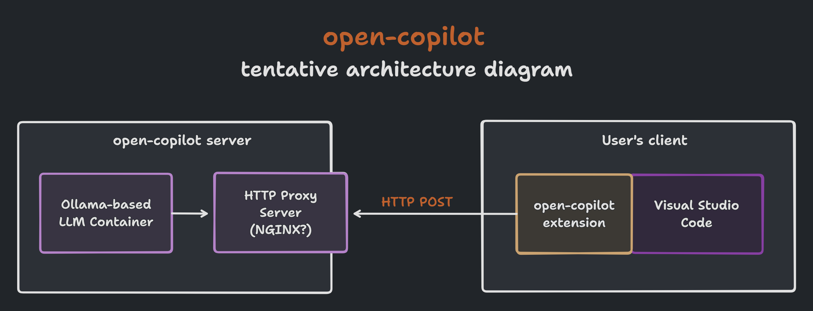

> [!NOTE]
> **Just go use [Continue.dev](https://docs.continue.dev/intro).** 
> 
> They've built exactly what I was hoping to achieve and it all works great out of the box 🎉 

  

# Open Copilot

an open-source, LLM-powered, privacy-focussed, GitHub Copilot alternative.

## Architecture

Here's an initial and tentative architecture diagram for how this system could work.

## Challenges

I see there being a few challenges in getting this project remotely close to viable as a GitHub Copulot replacement.

- **Accuracy**: ideally the model we use should be language agnostic and be able to provide relatively useful solutions. 
- **Latency**: GitHub Copilot provides suggestions so fast that they feel almost like they were being provided as types. Ideally this will be similarly fast. 
- **Hostability**: This ties into latency; most models require some serious compute so hosting this can be tricky. Finding a way to test models of varying sizes/hardware reqs would be great for optimizing this.

## Ideas

I'm going to use this spot as a place to drop ideas for now

- [ ] Possibility of replicating GitHub Copilot chat with this sytem as well.
- [ ] Using your current VS-Code workspace as an embedding so you can have more intelligent recommendations and you can use retrieval in chat.
